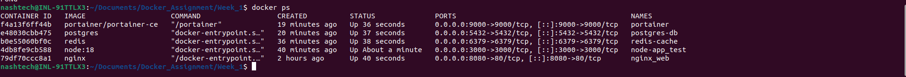
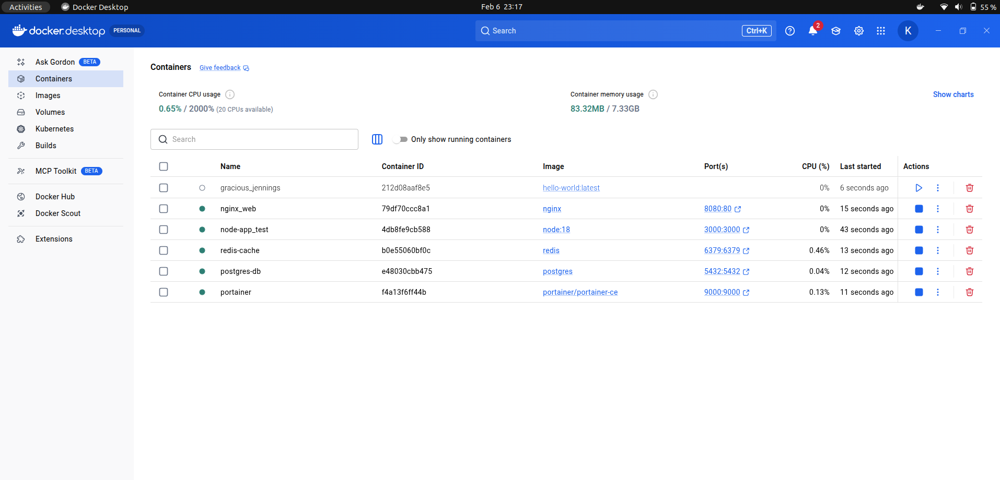
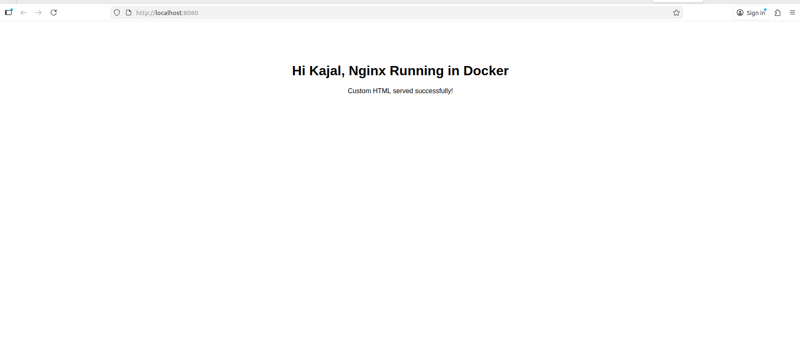
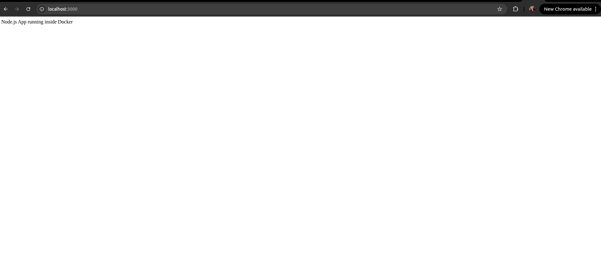
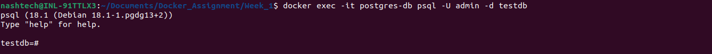
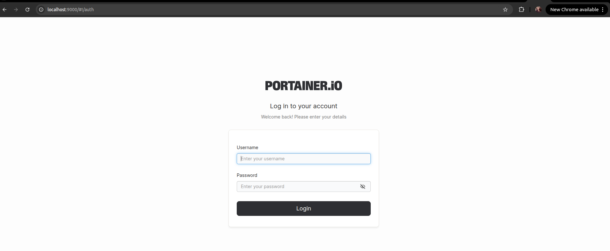
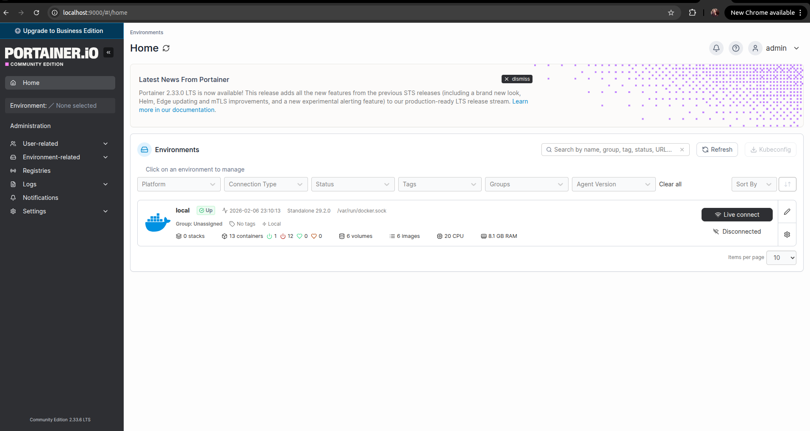

# Testing & Verification

## 1. Running Containers
Screenshot: `docker ps`

## 2. Nginx Test
http://localhost:8080

## 3. Node App Test
http://localhost:3000

## 4. Redis Test
redis-cli ping → PONG

## 5. PostgreSQL Test
psql connection successful

## 6. Portainer UI
http://localhost:9000

username: admin,
password: admin1234567

